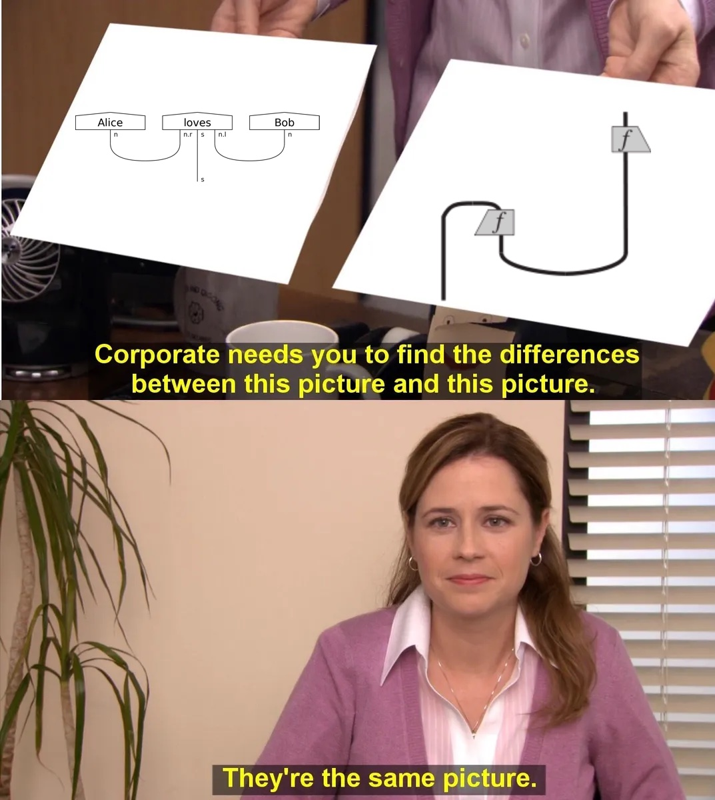

<style>
* { text-align: left; color: white; }
h1, strong, a { color: orange; font-weight: bold; text-decoration: none; }
img {
    display: block;
    margin-left: auto;
    margin-right: auto;
    background-color: white;
}
</style>

<style scoped> * { text-align: center; }</style>

# Category Theory for Quantum Natural Language Processing

$$\quad$$

Alexis TOUMI

18 Novembre, Marseille

---

<style scoped> * { text-align: center; }</style>

# ~~Category Theory for Quantum Natural Language Processing~~
# DisCoPy: a toolkit for computing with string diagrams

$$\quad$$

Alexis TOUMI

18 Novembre, Marseille

---

# QNLP: the recipe



### Three ingredients

$\text{Grammar}
\xrightarrow{\text{Category Theory}}
\text{Quantum}$

$$\quad$$

### Three steps

1) **Parse** text to get a **string diagram**
2) **Map** it to a circuit with a **functor**
3) **Tune** parameters to solve NLP tasks (e.g. question answering)

---

# You already use string diagrams without knowing it

* Quantum circuits (see **ZX-calculus**)
* Tensor networks (see **Penrose notation**)
* Neural networks
* Bayesian networks
* Concurrent processes
* Logical formulae (see C.S. Peirce's **existential graphs**)
* The grammar of this sentence is a string diagram!

---

# So what is a string diagram?

A **box** represents any process with a list of **wires** as input and output.

A **signature** is a collection of boxes and wires.

String diagrams can be defined by recursion:

* every box $f : x \to y$ is also a string diagram,
* the **identity** $\text{id}(x) : x \to x$ on a list of wires $x$ is a string diagram,
* so is the **composition** $g \circ f : x \to z$ of $f : x \to y$ and $g : y \to z$
* and the **tensor** $f \otimes f' : xx' \to yy'$ of $f : x \to y$ and $f' : x' \to y'$.

---

# So what is a string diagram?

<style scoped> img { float: left; margin-right: 50px; }</style>


* Sobocinski, [Graphical Linear Algebra](https://graphicallinearalgebra.net/), i.e. all string diagrams and no vectors!
* Selinger, [Survey of graphical languages for monoidal categories](https://arxiv.org/abs/0908.3347) (2010)
* Joyal & Street, [Planar diagrams and tensor algebra](http://www.math.mq.edu.au/~street/PlanarDiags.pdf) (1988)
* [The geometry of tensor calculus](https://core.ac.uk/download/pdf/82659437.pdf) (1991)
* Delpeuch & Vicary, [Normal forms for planar string diagrams](https://lmcs.episciences.org/8960/pdf) (2018)

---

# Quantum processes as string diagrams


Abramsky & Coecke

- [Physical traces: quantum vs. classical information](https://sciencedirect.com/science/article/pii/S1571066104805565/pdf) (2003)
- [A categorical semantics of quantum protocols](https://arxiv.org/abs/quant-ph/0402130) (2004)
- [Categorical quantum mechanics](https://arxiv.org/abs/0808.1023) (2008)

---

# This sentence is a string diagram


- Noam Chomsky, **Syntactic Structures** (1957)

---

# This sentence is a string diagram


- Joachim Lambek, **The mathematics of sentence structure** (1958)

* Joachim Lambek, **Type grammar revisited** (1997)
* Coecke et al., [DisCoCat framework](https://arxiv.org/abs/1003.4394) (2008, 2010)

---

# This Python code is a string diagram

```python
from discopy import Ty, Word, Id, Cup

s, n = Ty('s'), Ty('n')
Alice, loves, Bob = Word('Alice', n), Word('loves', n.r @ s @ n.l), Word('Bob', n)

sentence = Alice @ loves @ Bob >> Cup(n, n.r) @ Id(s) @ Cup(n.l, n)
```


---

# Monoidal categories

A monoidal category $C$ is just a pair of types for **objects** and **arrows** with methods:

- `dom` and `cod` from arrows to objects,
- `id` from objects to arrows,
- `then` and `tensor` from pairs of arrows to arrows.

For example:

- `(Ty, Diagram)` is the **free monoidal category** on a given signature,
- `(type, Function)`, `(int, Matrix)`, `(list[int], Tensor)`, etc.

---

# Monoidal functors

A monoidal functor $F : C \to D$ is just a pair of mappings:

- `ob` from objects of $C$ to objects of $D$,
- `ar` from arrows of $C$ to arrows of $D$.

For example $F :$ `(Ty, Diagram)` $\to$ `(list[int], Tensor)`

```python
from discopy.tensor import Functor

F = Functor(ob={s: 1, n: 2},
            ar={Alice: [1, 0], loves: [[0, 1], [1, 0]], Bob: [0, 1]})

assert F(sentence)
```

---

# QNLP models

We define a QNLP model as a monoidal functor:

$$
F : \mathbf{Grammar} \to \mathbf{Circuit}
$$


---

# QNLP models

We define a QNLP model as a monoidal functor:

$$
F : \mathbf{Grammar} \to \mathbf{Circuit}
$$

```python
from discopy.quantum import qubit, Ket, H, X, CX, sqrt
from discopy.circuit import Functor

F_ = circuit.Functor(
    ob={s: Ty(), n: qubit},
    ar={Alice: Ket(0), loves: sqrt(2) @ Ket(0, 0) >> H @ X >> CX, Bob: Ket(1)})

assert F_(sentence).eval() == F(sentence)
```

---

# QNLP models

We define a QNLP model as a **parameterised** monoidal functor:

$$
\big\{ F_\theta : \mathbf{Grammar} \to \mathbf{Circuit} \big\}_{\theta \in \Theta}
$$

Given a dataset $X = \{ (f, y) \}$ with $f$ a sentence and $y$ its truth value, we want to find the optimal functor $F^\star = F_{\theta^\star}$:

$$
\theta^\star = \mathop{\text{argmin}}_{\theta \in \Theta} \sum_{(f, y) \in X}
\text{loss}(F_\theta(f), y)
$$

We call this **functorial learning**, a new category-theoretic approach to structured machine learning.

---

# Diagrammatic Differentiation for Quantum Machine Learning

joint work with **Richie Yeung** and **Giovanni de Felice**


---

# Check it out!

<style scoped> p { text-align: center; }</style>


`pip install discopy`

https://discopy.org
