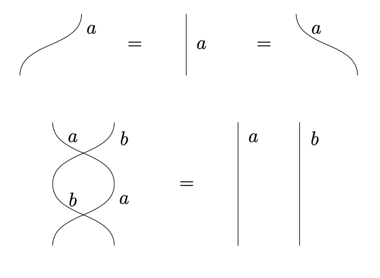
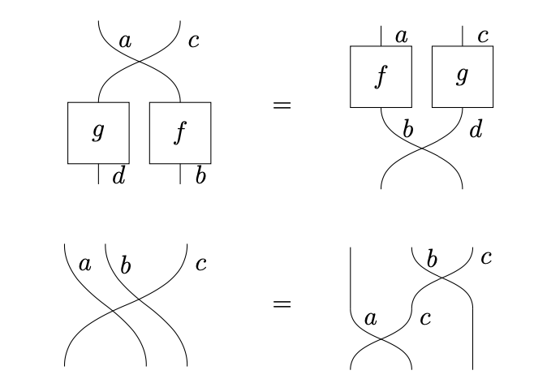
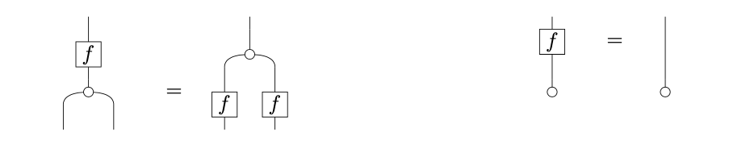
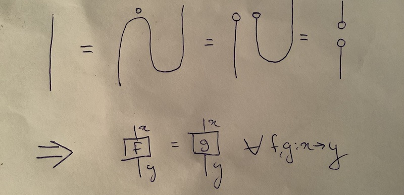
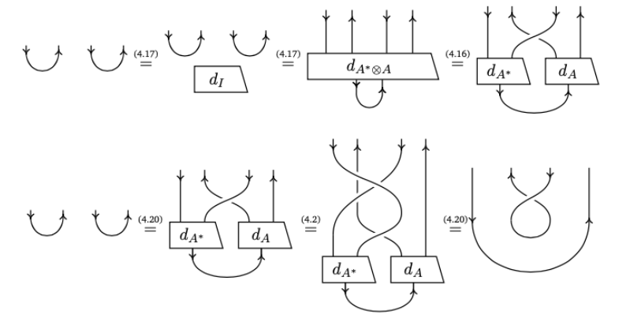
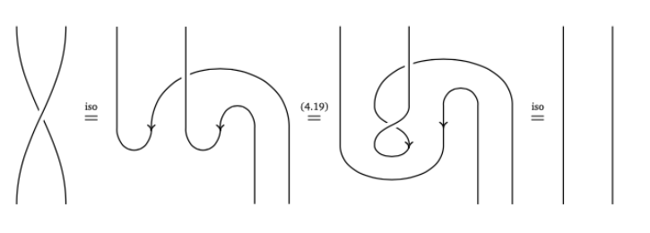
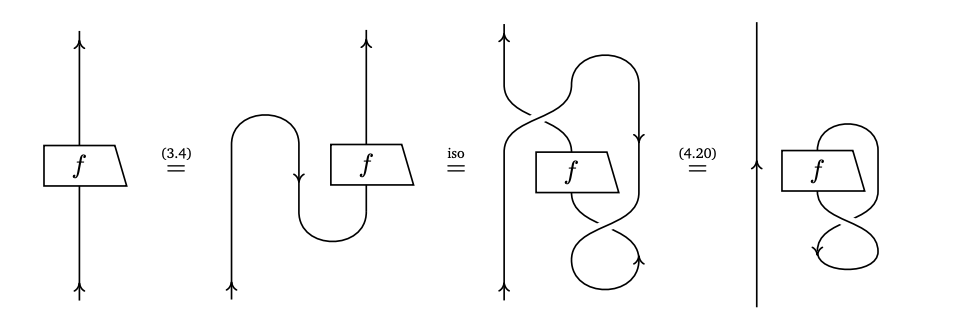
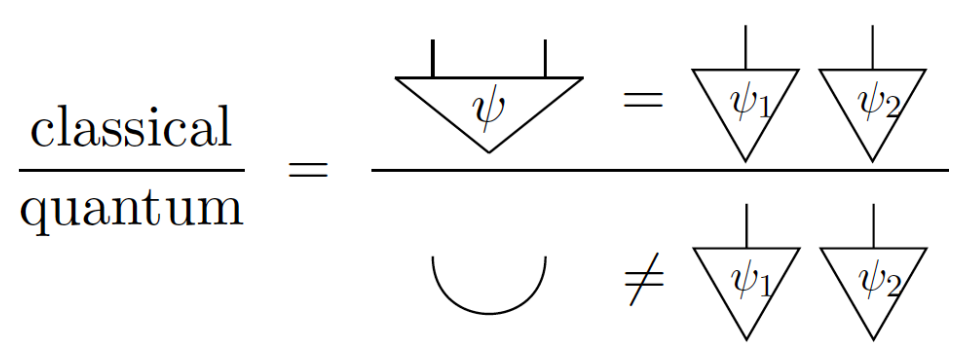

<style>
* { text-align: left; color: white; }
h1, strong, a { color: orange; font-weight: bold; text-decoration: none; }
img {
    display: block;
    margin-left: auto;
    margin-right: auto;
    background-color: white;
}
</style>

<style scoped> * { text-align: center; }</style>

# Category Theory for Quantum Natural Language Processing

$$\quad$$

Alexis TOUMI

29 Novembre, Marseille

---

# Boxes and signatures

A box represents any **process** with **systems** as input and output.


A (monoidal) **signature** $\Sigma = (\Sigma_0, \Sigma_1, \text{dom}, \text{cod})$ is given by:

* a pair of classes $\Sigma_0, \Sigma_1$ for wires and boxes
* a pair of maps $\text{dom}, \text{cod} : \Sigma_1 \to \Sigma_0^\star$ from boxes to lists of wires.

---

# Morphisms of signatures


Given a signature $\Sigma$, we write $f : x \to y \in \Sigma$ for $f \in \Sigma_1$ and $x, y \in \Sigma_0^\star$ with $\text{dom}(f) = x$ and $\text{cod}(f) = y$.

Given two signatures $\Sigma$ and $\Sigma'$,
a **morphism** $F : \Sigma \to \Sigma'$ is a pair of maps:

- $F_0 : \Sigma_0 \to (\Sigma'_0)^\star$ from wire to list of wires
- $F_1 : \Sigma_1 \to \Sigma_1'$ from box to box

such that for all boxes $f : x \to y \in \Sigma$ in the domain we have:

$$F_1(f) : F_0(x) \to F_0(y) \in \Sigma'$$

---

# Diagrams: definition

Given a signature $\Sigma$, we can define (string) diagrams $f : x \to y \in D(\Sigma)$ by recursion:

* every box $f : x \to y \in \Sigma_1$ is also a diagram $f \in D(\Sigma)$,
* the **identity** $\text{id}(x) : x \to x$ on a list of wires $x$ is a diagram,
* so is the **composition** $g \circ f : x \to z$ of $f : x \to y$ and $g : y \to z$
* and the **tensor** $f \otimes f' : xx' \to yy'$ of $f : x \to y$ and $f' : x' \to y'$.

---

# Diagrams: definition

Diagrams are subject to three axioms.

- Tensor and composition are **associative** and **unital**.
- They satisfy the following **naturality** equation.

$$ (g \circ f) \otimes (g' \circ f') \ = \ (g \otimes g') \circ (f \otimes f') $$

From a signature $\Sigma$, we get another signature $\mathbf{C}_\Sigma$ with wires $\Sigma_0$ and diagrams $D(\Sigma)$ as boxes, and a morphism of signatures $\Sigma \hookrightarrow \mathbf{C}_\Sigma$.

---

# Diagrams: cooking

Can't be bothered to remember the axioms for diagrams? Your visual cortex has them built in!

* Wires are **ingredients**.
* Boxes are **cooking steps**.
* Diagrams are **recipes**.

In physical terms, naturality means parallel processes are **spacelike-separated** events.


---

# Categories: definition

A (strict monoidal) **category** $\mathbf{C}$ is a signature with three maps:

$$
\text{id} : \mathbf{C}_0^\star \to \mathbf{C}_1
$$
$$
(\circ) : \mathbf{C}_1 \times \mathbf{C}_1 \to \mathbf{C}_1
\qquad \text{and} \qquad
(\otimes) : \mathbf{C}_1 \times \mathbf{C}_1 \to \mathbf{C}_1
$$

such that associativity, unitality and naturality hold. For example:

* $\mathbf{C}_\Sigma$: wires and diagrams.
* $\mathbf{Set}$: sets and functions (with cartesian product as tensor).
* $\mathbf{Hilb}$: Hilbert spaces and linear maps (with the tensor product).

---

# Categories: theorem

A (strict monoidal) **functor** $F : \mathbf{C} \to \mathbf{D}$ is a morphism of signatures that preserves identity, composition and tensor.

**Theorem** *(Joyal & Street, 1988)*: $\mathbf{C}_\Sigma$ is the free monoidal category.

$$
\mathbf{MonCat}(\mathbf{C}_\Sigma, \mathbf{D})
\simeq \mathbf{MonSig}(\Sigma, \mathbf{D})
$$

**Intuition:** The functors $F : \mathbf{C}_\Sigma \to \mathbf{D}$ are uniquely determined by their image on boxes, i.e. a morphism of signatures $F : \Sigma \to \mathbf{D}$.

---

# Categories: grammar

Chomsky, **Syntactic Structures** (1957)


* Wires are grammatical **types**.
* Boxes are grammatical **rules**.
* Diagrams are **syntax**, functors into $\mathbf{Set}$ are **semantics**.

---

# Categories: grammar


- Joachim Lambek, **The mathematics of sentence structure** (1958)

* Joachim Lambek, **Type grammar revisited** (1997)
* Coecke et al., [DisCoCat framework](https://arxiv.org/abs/1003.4394) (2008, 2010)

---

# Categories: quantum

Abramsky & Coecke, [Categorical quantum mechanics](https://arxiv.org/abs/0808.1023) (2008)
[A categorical semantics of quantum protocols](https://arxiv.org/abs/quant-ph/0402130) (2004)


* Wires are quantum **systems**.
* Boxes are quantum **processes**.
* Diagrams are **protocols**, functors into $\mathbf{Hilb}$ are **semantics**.

---

# Categories: symmetric

A category is symmetric if it comes with **swaps**.

<style scoped> section img { display: block; float: left; }</style>





---

# Categories: dagger compact

A symmetric category is compact if it has **cups and caps** satisfying the **snake equation**:


A category is dagger if it comes with a contravariant identity-on-objects involution functor: the **vertical reflection** of a diagram.
It is **dagger compact** if cap is the dagger of cup.

---

# Categories: cartesian

A symmetric category is cartesian if it has **copy and discard**.




In physical terms, the last equation (again called **naturality**) is **causality**: the future cannot influence the past.

---

# Categorical no-deleting

**Theorem:** $\ \text{compact} \ + \ \text{discard} \implies \text{trivial}$



- Abramsky, [No-cloning in categorical quantum mechanics](https://arxiv.org/abs/0910.2401) (2009)
- Heunen & Vicary **Categories for Quantum Theory** (2019)

---

# Categorical no-cloning

**Lemma:** Suppose a symmetric category has both cups and copy.



---

# Categorical no-cloning

**Theorem:** $\text{compact} \ + \ \text{copy} \implies \text{(almost) trivial}$


**Entanglement** is "*the* characteristic trait of quantum mechanics".


---

# ZX-calculus

**Applications:**

- circuit simplification
- circuit compilation
- error correction
- ...
- quantum natural language processing!

https://zxcalculus.com/


---

# QNLP: recipe


### Three ingredients

$\text{Grammar}
\xrightarrow{\text{Category Theory}}
\text{Quantum}$

$$\quad$$

### Three steps

1) **Parse** the text to get a **diagram**
2) **Map** it to quantum with a **functor**
3) **Tune** parameters to solve NLP tasks (e.g. question answering)

---

# QNLP: definition

We define a QNLP model as a monoidal functor:

$$
F : \mathbf{Grammar} \to \mathbf{Circuit}
$$


---

# QNLP: implementation

We define a QNLP model as a monoidal functor:

$$
F : \mathbf{Grammar} \to \mathbf{Circuit}
$$

```python
from discopy.quantum import qubit, Ket, H, X, CX, sqrt
from discopy.circuit import Functor

F_ = circuit.Functor(
    ob={s: Ty(), n: qubit},
    ar={Alice: Ket(0), loves: sqrt(2) @ Ket(0, 0) >> H @ X >> CX, Bob: Ket(1)})

assert F_(sentence).eval() == F(sentence)
```

---

# QNLP: training

We define a QNLP model as a **parameterised** monoidal functor:

$$
\big\{ F_\theta : \mathbf{Grammar} \to \mathbf{Circuit} \big\}_{\theta \in \Theta}
$$

Given a dataset $X = \{ (f, y) \}$ with $f$ a sentence and $y$ its truth value, we want to find the optimal functor $F^\star = F_{\theta^\star}$:

$$
\theta^\star = \mathop{\text{argmin}}_{\theta \in \Theta} \sum_{(f, y) \in X}
\text{loss}(F_\theta(f), y)
$$

We call this **functorial learning**, a new category-theoretic approach to structured machine learning.

---

# Diagrammatic Differentiation for Quantum Machine Learning

joint work with **Richie Yeung** and **Giovanni de Felice**


---

# DisCoPy: the Python toolkit for computing with string diagrams

<style scoped> p { text-align: center; }</style>


https://www.discopy.org
