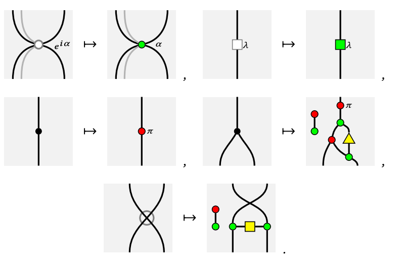

# The Frobenius Anatomy of Distributed Quantum Protocols

$$\quad$$

Alexis TOUMI

9 Jan. 2023, LMF Paris–Saclay

$$\quad$$

---

# Boxes and signatures

A box represents any **process** with **systems** as input and output.

A (monoidal) **signature** $\Sigma = (\Sigma_0, \Sigma_1, \text{dom}, \text{cod})$ is given by:

* a pair of classes $\Sigma_0, \Sigma_1$ for wires and boxes
* a pair of maps $\text{dom}, \text{cod} : \Sigma_1 \to \Sigma_0^\star$ from boxes to lists of wires.

---

# Boxes and signatures

Given two signatures $\Sigma$ and $\Sigma'$,
a **morphism** $F : \Sigma \to \Sigma'$ is a pair of maps:

- $F_0 : \Sigma_0 \to (\Sigma'_0)^\star$ from wire to list of wires
- $F_1 : \prod_{x, y} \Sigma(x, y) \to \Sigma'(F(x), F(y))$ from box to box

where $\Sigma(x, y) = \{ \ f \in \Sigma_1 \ \vert \ \text{dom}(f) = x, \text{cod}(f) = y \ \}$.

---

# Diagrams: definition

Given a signature $\Sigma$, we can define (string) diagrams $f : x \to y \in D(\Sigma)$ by recursion:

* every box $f : x \to y \in \Sigma_1$ is also a diagram $f \in D(\Sigma)$,
* the **identity** $\mathtt{id}(x) : x \to x$ on a list of wires $x$ is a diagram,
* so is the **composition** $g \circ f : x \to z$ of $f : x \to y$ and $g : y \to z$
* and the **tensor** $f \otimes f' : xx' \to yy'$ of $f : x \to y$ and $f' : x' \to y'$.

---

# Diagrams: definition

Diagrams are subject to three axioms.

- Tensor and composition are **associative** and **unital**.
- The **interchanger** $(g \circ f) \otimes (g' \circ f') \ = \ (g \otimes g') \circ (f \otimes f')$,
  which is equivalent to the following **spacelike separation** axiom:

---

# Diagrams: quantum circuits

Quantum gate sets are signatures!

 

* Wires are **bits** and **qubits**.
* Boxes are quantum **gates**
  and **measurements**.
* Diagrams are **circuits**.

---

# Diagrams: grammatical structures

Formal grammars are signatures!

Chomsky: **Syntactic Structures** (1957)

 
 

* Wires are grammatical **types**.
* Boxes are grammatical **rules**.
* Diagrams are **grammatical structures**.

---

# Diagrams: grammatical structures

- Lambek: **The mathematics of sentence structure** (1958)

* Lambek: **Type grammar revisited** (1997)
* Clark, Sadrzadeh & Coecke: **DisCoCat** (2008)

---

# Categories: definition

A (strict monoidal) **category** $\mathbf{C}$ is a signature with three maps

$\mathtt{id} : \prod_{x} \mathbf{C}(x, x)$
$\mathtt{then} : \prod_{x, y, z} \mathbf{C}(x, y) \times \mathbf{C}(y, z) \to \mathbf{C}(x, z)$
$\mathtt{tensor} : \prod_{x, y} \prod_{x', y'} \mathbf{C}(x, y) \times \mathbf{C}(x', y') \to \mathbf{C}(xx', yy')$

such that associativity, unitality and naturality hold.

---

# Functors: theorem

A (strict monoidal) **functor** $F : \mathbf{C} \to \mathbf{D}$ is a morphism of signatures that preserves identity, composition and tensor.

**Theorem** *(Joyal & Street, 1988)*: $\mathbf{C}_\Sigma$ is the free monoidal category.

$$
\mathbf{MonCat}(\mathbf{C}_\Sigma, \mathbf{D})
\simeq \mathbf{MonSig}(\Sigma, \mathbf{D})
$$

**Intuition:** The functors $F : \mathbf{C}_\Sigma \to \mathbf{D}$ are uniquely determined by their image on boxes, i.e. a morphism of signatures $F : \Sigma \to \mathbf{D}$.

---

# Functors: ZX and ZW calculi

|  |  |
|---|---|

Hadzihasanovic, Ng, Wang: [Two complete axiomatisations of pure-state qubit quantum computing](https://dl.acm.org/doi/10.1145/3209108.3209128) (2018)

---

# Functors: Montague semantics

- Montague, **English as a formal language** (1974)

Natural language **semantics** as a functor $F : \mathbf{G} \to \mathbf{Set}$, defined using the **lambda calculus** and **first-order logic**.

---

# Functors: DisCoCat semantics

- Coecke, Sadrzadeh & Clark, [Mathematical Foundations for a Compositional Distributional Model of Meaning](https://arxiv.org/abs/1003.4394) (2010)

**DisCoCat** models are functors $F : \mathbf{G} \to \mathbf{Vect}$, unifying **Dis(tributional)** and **Co(mpositional)** semantics with **Cat(egories)**.

---

# Functors: QNLP

A QNLP model is a functor $F : \mathbf{Grammar} \to \mathbf{Qubit}$.

 

- Zeng & Coecke: **Quantum algorithms for compositional natural language processing** (2016)
- Wiebe et al.: **Quantum language processing** (2019)
- Meichanetzidis, Toumi, de Felice, Coecke: [Grammar-Aware Question-Answering on Quantum Computers](https://arxiv.org/abs/2012.03756) (2020)

---

# Frobenius algebras: definition

Coecke, Kissinger: **The Compositional Structure of Multipartite Quantum Entanglement** (2010)

---

# Frobenius algebras: (anti-)special

---

# Frobenius algebras: SLOCC

Dur, Vidal, Cirac:
**Three qubits can be entangled in two inequivalent ways.** (2000)

---

# Frobenius algebras: GHZ and W

---

# Frobenius algebras: leader election

If we assume GHZ and W as given, then we can solve
**distributed consensus** and **leader election**.

|  |  |
| --- | --- |

D’Hondt & Panangaden:
**The Computational Power of the W and GHZ states** (2003)

---

# Frobenius algebras: leader election

Tani, Kobayashi, Matsumoto:
**Exact Quantum Algorithms for the Leader Election Problem** (2007)

---

# Frobenius algebras: leader election

Tani, Kobayashi, Matsumoto:
**Exact Quantum Algorithms for the Leader Election Problem** (2007)

---

# Frobenius algebras: leader election

Tani, Kobayashi, Matsumoto:
**Exact Quantum Algorithms for the Leader Election Problem** (2007)

---

# Frobenius algebras: linguistics

- Sadrzadeh, Clark, Coecke:
  **The Frobenius anatomy of word meanings** (2013)
- Buet: **W-spiders** (2017)

---

# Frobenius algebras: linguistics

- Coecke, de Felice, Marsden, Toumi: **Towards compositional distributional discourse analysis** (2018)

---

# Future directions

- Multipartite entanglement as a resource for advantage in QNLP
- Diagrammatic verification for distributed quantum protocols
- Abramsky, Shah: **Relating structure and power** (2021)
  with game comonads to bound the communication complexity

 
 

**Thanks!**
