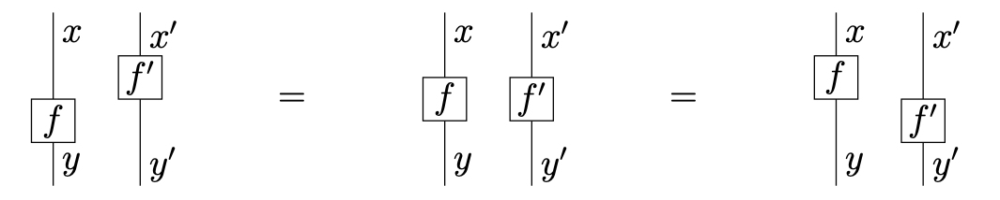
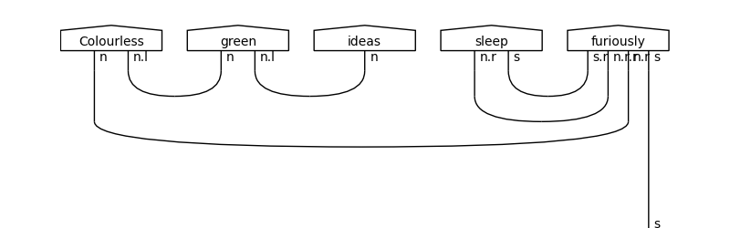
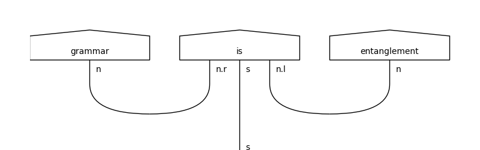
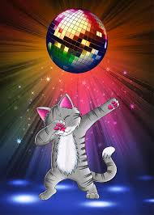
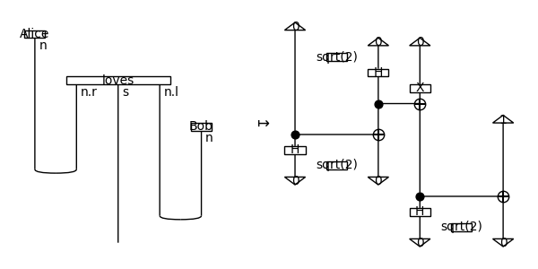
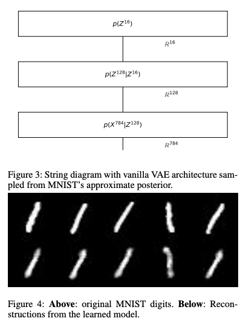
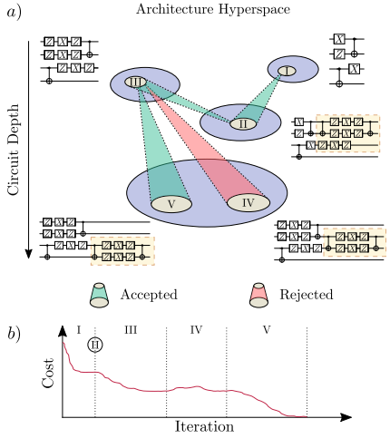

<style>
* { text-align: left; color: white; }
h1, strong, a { color: orange; font-weight: bold; text-decoration: none; }
img {
    display: block;
    margin-left: auto;
    margin-right: auto;
    background-color: white;
}
section table thead th {
    background-color: black;
}
section table th, section table td {
    border: none;
}
</style>

# Learning functors for quantum structured prediction

<style scoped> h1 { text-align: center; }</style>

$$\quad$$

Alexis TOUMI

16 Feb. 2023, LORIA Nancy

$$\quad$$

---

# Boxes and signatures

A box represents any **process** with **systems** as input and output.


A (monoidal) **signature** $\Sigma = (\Sigma_0, \Sigma_1, \text{dom}, \text{cod})$ is given by:

* a pair of classes $\Sigma_0, \Sigma_1$ for wires and boxes
* a pair of maps $\text{dom}, \text{cod} : \Sigma_1 \to \Sigma_0^\star$ from boxes to lists of wires.

---

# Boxes and signatures

Given two signatures $\Sigma$ and $\Sigma'$,
a **morphism** $F : \Sigma \to \Sigma'$ is a pair of maps:

- $F_0 : \Sigma_0 \to (\Sigma'_0)^\star$ from wire to list of wires
- $F_1 : \prod_{x, y} \Sigma(x, y) \to \Sigma'(F(x), F(y))$ from box to box

where $\Sigma(x, y) = \{ \ f \in \Sigma_1 \ \vert \ \text{dom}(f) = x, \text{cod}(f) = y \ \}$.

---

# Diagrams: definition

Given a signature $\Sigma$, we can define (string) diagrams $f : x \to y \in D(\Sigma)$ by recursion:

* every box $f : x \to y \in \Sigma_1$ is also a diagram $f \in D(\Sigma)$,
* the **identity** $\mathtt{id}(x) : x \to x$ on a list of wires $x$ is a diagram,
* so is the **composition** $g \circ f : x \to z$ of $f : x \to y$ and $g : y \to z$
* and the **tensor** $f \otimes f' : xx' \to yy'$ of $f : x \to y$ and $f' : x' \to y'$.

---

# Diagrams: definition

Diagrams are subject to three axioms.

- Tensor and composition are **associative** and **unital**.
- The **interchanger** $(g \circ f) \otimes (g' \circ f') \ = \ (g \otimes g') \circ (f \otimes f')$,
  which is equivalent to the following **spacelike separation** axiom:



---

# Diagrams: quantum circuits

Quantum gate sets are signatures!

<br>

<style scoped> section img { display: block; float: right; }</style>


* Wires are **bits** and **qubits**.
* Boxes are quantum **gates**
  and **measurements**.
* Diagrams are **circuits**.

---

# Diagrams: grammatical structures

<style scoped> section img { display: block; float: right; }</style>


Formal grammars are signatures!

Chomsky: **Syntactic Structures** (1957)

<br>
<br>

* Wires are grammatical **types**.
* Boxes are grammatical **rules**.
* Diagrams are **grammatical structures**.

---

# Diagrams: grammatical structures

- Lambek: **The mathematics of sentence structure** (1958)



* Lambek: **Type grammar revisited** (1997)
* Clark, Sadrzadeh & Coecke: **DisCoCat** (2008)

---

# Categories: definition

A (strict monoidal) **category** $\mathbf{C}$ is a signature with three maps

$\mathtt{id} : \prod_{x} \mathbf{C}(x, x)$
$\mathtt{then} : \prod_{x, y, z} \mathbf{C}(x, y) \times \mathbf{C}(y, z) \to \mathbf{C}(x, z)$
$\mathtt{tensor} : \prod_{x, y} \prod_{x', y'} \mathbf{C}(x, y) \times \mathbf{C}(x', y') \to \mathbf{C}(xx', yy')$

such that associativity, unitality and naturality hold.

---

# Functors: theorem

A (strict monoidal) **functor** $F : \mathbf{C} \to \mathbf{D}$ is a morphism of signatures that preserves identity, composition and tensor.

**Theorem** *(Joyal & Street, 1988)*: $\mathbf{C}_\Sigma$ is the free monoidal category.

$$
\mathbf{MonCat}(\mathbf{C}_\Sigma, \mathbf{D})
\simeq \mathbf{MonSig}(\Sigma, \mathbf{D})
$$

**Intuition:** The functors $F : \mathbf{C}_\Sigma \to \mathbf{D}$ are uniquely determined by their image on boxes, i.e. a morphism of signatures $F : \Sigma \to \mathbf{D}$.

---

# Functors: Montague semantics

- Montague, **English as a formal language** (1974)


Natural language **semantics** as a functor $F : \mathbf{G} \to \mathbf{Set}$, defined using the **lambda calculus** and **first-order logic**.

---

# Functors: DisCoCat models

- Coecke, Sadrzadeh & Clark, [Mathematical Foundations for a Compositional Distributional Model of Meaning](https://arxiv.org/abs/1003.4394) (2010)

|  |  |
|---|---|

**DisCoCat** models are functors $F : \mathbf{G} \to \mathbf{Hilb}$, unifying **Dis(tributional)** and **Co(mpositional)** semantics with **Cat(egories)**.

---

# Categorical quantum mechanics

- Abramsky & Coecke, [Categorical quantum mechanics](https://arxiv.org/abs/0808.1023) (2008)
  [A categorical semantics of quantum protocols](https://arxiv.org/abs/quant-ph/0402130) (2004)


The principles of quantum theory as properties of the category $\mathbf{Hilb}$.

---

# QNLP: recipe


### Three ingredients

$\text{Grammar}
\xrightarrow{\text{Category Theory}}
\text{Quantum}$

$$\quad$$

### Three steps

1) **Parse** the text to get a **diagram**
2) **Map** it to quantum with a **functor**
3) **Tune** parameters to solve NLP tasks (e.g. question answering)

---

# QNLP: definition

We define a QNLP model as a monoidal functor $F : \mathbf{G} \to \mathbf{Circuit}$.



- Zeng & Coecke, **Quantum algorithms for compositional natural language processing** (2016)
- Wiebe et al., **Quantum language processing** (2019)

---

# QNLP: training

We define a QNLP model as a **parameterised** monoidal functor:

$$
\big\{ F_\theta : \mathbf{G} \to \mathbf{Circuit} \big\}_{\theta \in \Theta}
$$

Given a dataset $X = \{ (f, y) \}$ with $f$ a sentence and $y$ its truth value, we want to find the optimal functor $F^\star = F_{\theta^\star}$ where

$$
\theta^\star = \mathop{\text{argmin}}_{\theta \in \Theta} \sum_{(f, y) \in X}
\text{loss}(F_\theta(f), y)
$$

We call this approach **functorial learning**, a new category-theoretic approach to structured machine learning.

---

# Learning distributed protocols


[Practical distributed quantum information processing with LOCCNet](https://www.nature.com/articles/s41534-021-00496-x), Zhao et al. (2021)

---

# Functorial generative modeling

<style scoped> section img { display: block; float: right; }</style>



So far, our framework only defines **discriminative models** $\mathbb{P}(\text{value} \ \vert \ \text{diagram})$.

In order to solve more general tasks (e.g. translation, summarisation) we would need **generative models** $\mathbb{P}(\text{diagram}, \text{value})$.

[Learning a Deep Generative Model like a Program: the Free Category Prior](https://arxiv.org/abs/2011.11063), Sennesh (2020)

---

# Functorial generative modeling

<style scoped> section img { display: block; float: right; }</style>



Learning QNLP models requires two steps $F = \mathbf{G} \xrightarrow{F_\Theta} \mathbf{Circuit}_\Theta \xrightarrow{\theta^\star} \mathbf{Circuit}$:

1. combinatorial search for a good **ansatz** $F_\Theta : \mathbf{G} \to \mathbf{Circuit}_\Theta$
2. gradient descent to find optimal $\theta^\star \in \Theta$

[A semi-agnostic ansatz with variable structure for quantum machine learning](https://arxiv.org/abs/2103.06712), Bilkis et al. (2021)

---

# Diagrammatic Differentiation for Quantum Machine Learning

joint work with **Richie Yeung** and **Giovanni de Felice**


---

# DisCoPy: the Python toolkit for computing with string diagrams

```python
s, n = Ty('s'), Ty('n')
Alice, loves, Bob = Word('Alice', n), Word('loves', n.r @ s @ n.l), Word('Bob', n)

sentence = Alice @ loves @ Bob >> Cup(n, n.r) @ Id(s) @ Cup(n.l, n)

F = Functor(
    ob={s: Ty(), n: qubit},
    ar={Alice: Ket(0), loves: sqrt(2) @ Ket(0, 0) >> H @ X >> CX, Bob: Ket(1)},
    cod=Category(circuit.Ty, Circuit))

assert F(sentence).eval()
```

<style scoped> p { text-align: center; }</style>

https://discopy.org