

# Peirce's existential graphs: string diagrams for predicate logic

$$\quad$$

Alexis TOUMI

May 31st, 2023

Knowledge Exchange, PlantingSpace

---

# C.S. Peirce (1839–1914)

## An underrated philosopher

The father of pragmatism, summarised in his maxim:

> *Consider the practical effects of the objects of your conception. Then, your conception of those effects is the whole of your conception of the object.*

* A theory of categories (1. Feeling, 2. Reaction, 3. Representation)
* A theory of semiotics (1. Sign, 2. Object, 3. Interpretant)

---

# C.S. Peirce (1839–1914)

## An underrated mathematician

* Arithmetics of infinite cardinals before Cantor
* Natural number arithmetics before Peano
* Axiomatic set theory (two decades before Zermelo)
* A precursor of Bayesian probability (he coined the terms "confidence" and "likelihood"!)

---

# C.S. Peirce (1839–1914)

## An underrated logician

* Developed De Morgan's theory of relations (1870)
* NOR gates generate all Boolean operations (1880)
* Boolean operations with electrical switches (1886)
* Invented predicate logic independently of Frege
* Pioneered string diagrams 80 years before Penrose

---

# So, why is he forgotten today?

* Published almost nothing, left over 100,000 manuscript pages.
* Isolated in the U.S. at a time when Europe was the place to be.
* His theory of semiotics was overwhelmed by Saussure's semiology.
* His predicate logic was overwhelmed by Frege's Begriffsschrift.
* His existential graphs were impossible to typeset without $\LaTeX$.

---

# A precursor of category theory

* *A String Diagram Calculus for Prediate Logic and C. S. Peirce's System Beta*, Brady & Trimble (1998)
* *A categorical interpretation of C.S. Peirce's propositional logic Alpha*, Brady & Trimble (2000)
* *Understanding Visualization: A Formal Approach Using Category Theory and Semiotics*, Vickers et al. (2012)
* *Diagrammatic immanence: Category theory and philosophy (Spinoza, Peirce and Deleuze)*, Gangle (2016)
* *A bifibrational reconstruction of Lawvere's presheaf hyperdoctrine*, Melliès & Zeilberger (2016)

---

# Boolean logic with system alpha

**Definition:** An alpha graph $G$ is either:

- A blank page called the **sheet of assertion**, representing truth $G = \top$
- A node with a label representing an atomic proposition $G \in \{ p_1, \dots, p_n \}$
- The disjoint union of two alpha graphs, representing conjunction $G = G_0 \land G_1$
- An alpha graph inside a circle called **cut**, representing negation $G = \neg G'$

---

# Boolean logic with system alpha

**Lemma:** This inductive definition can equivalently be given geometrically as:

- a finite set of points $X \subseteq \mathbb{R}^2$ with labels $\lambda : X \to \{ p_1, \dots, p_n \}$
- a finite set of circles embedded in the plane $S_1 \times \dots \times S_1 \hookrightarrow \mathbb{R}^2 - F$

Topological isomorphism of alpha graphs corresponds to conjunction being a commutative monoid:

$$F \land G = G \land F
\qquad
G \land \top = G = \top \land G
\qquad
F \land (G \land H) = (F \land G) \land H$$

---

# Boolean logic with system alpha

**Theorem:** We can do all of Boolean algebra with diagrams!

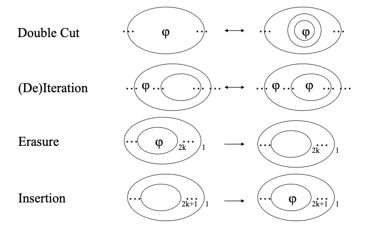

---

# Boolean logic with system alpha

**Aside:** Defining trees with nested circles should be familiar:

---

# Predicate logic with system beta

**Intuition:** Predicates are like atoms, they have bonds:

|   |   |
|---|---|
|  |  |

These are called **lines of identity**, they can split to identify variables.

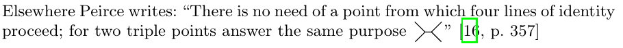

---

# Predicate logic with system beta

*Graphical Conjunctive Queries*, Bonchi, Seeber & Sobociński (2018)

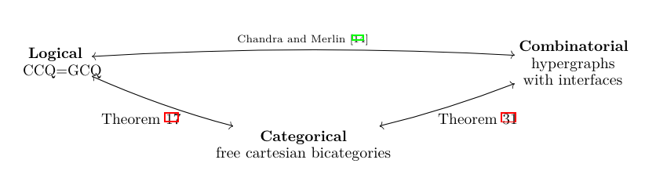
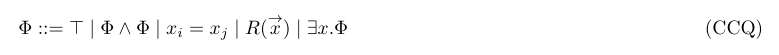
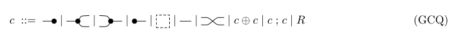

---

# Predicate logic with system beta

*Graphical Conjunctive Queries*, Bonchi, Seeber & Sobociński (2018)

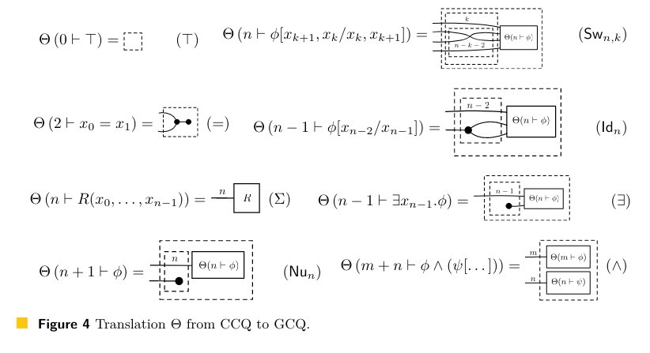

---

# Predicate logic with system beta

*Graphical Conjunctive Queries*, Bonchi, Seeber & Sobociński (2018)

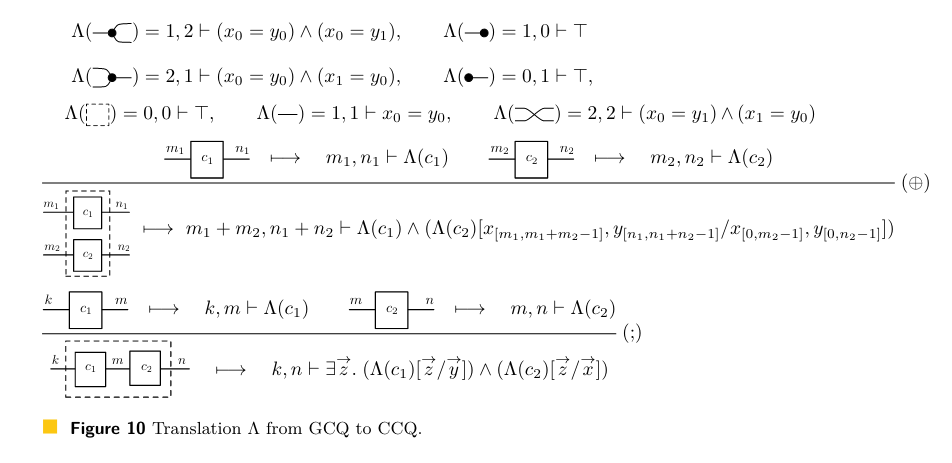

---

# Predicate logic with system beta

*Graphical Conjunctive Queries*, Bonchi, Seeber & Sobociński (2018)

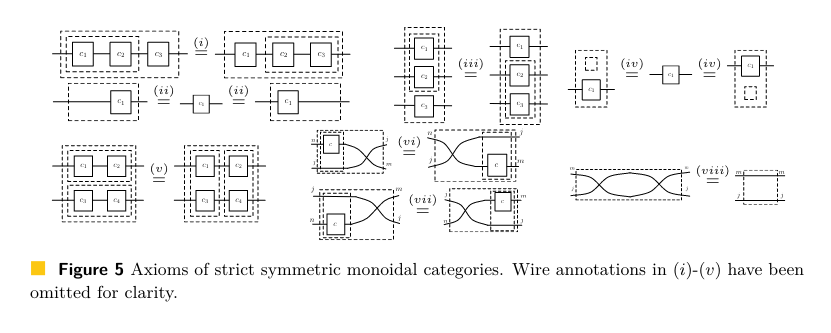

---

# Predicate logic with system beta

*Graphical Conjunctive Queries*, Bonchi, Seeber & Sobociński (2018)

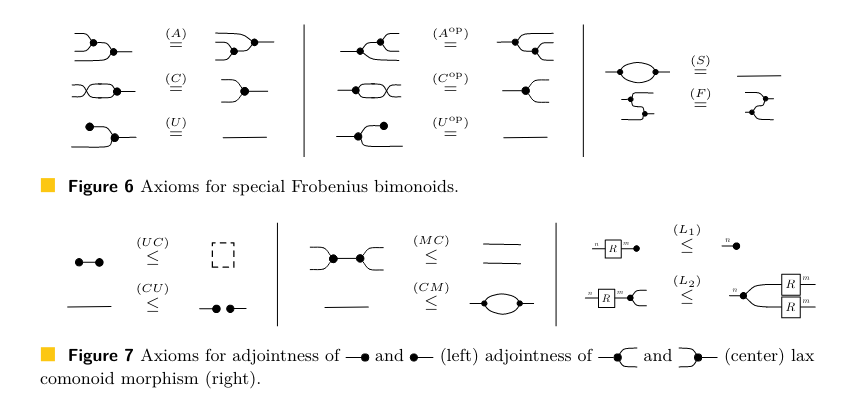

---

# Predicate logic with system beta

*Graphical Conjunctive Queries*, Bonchi, Seeber & Sobociński (2018)

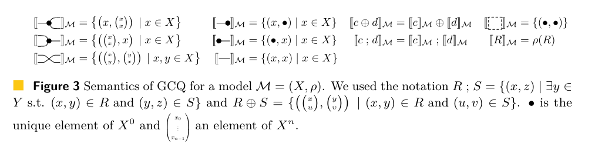

Relational models are functors $\mathbf{EG} \to \mathbf{Rel}$ where $\mathbf{EG}$ is the category of existential graphs and $\mathbf{Rel}$ the category of relations.

---

# Predicate logic with system beta

*Compositional Diagrammatic First-Order Logic*, Haydon & Sobociński (2020)

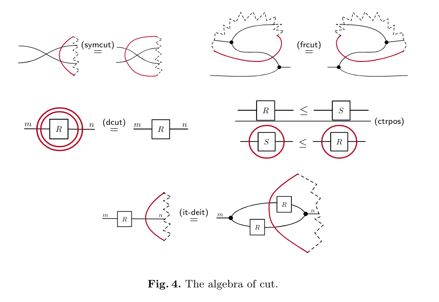

---

# Predicate logic with system beta

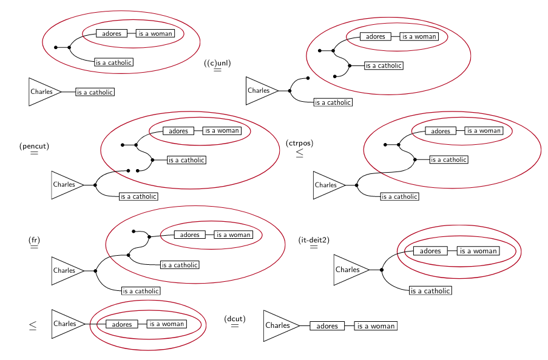

---

# Conclusion

- Predicate logic without variables!
- Diagrams as formulae, rewrites as proofs.
- Semantics as monoidal functors into $\mathbf{Rel}$.

* Can we build existential graphs from natural language?
* Can we define probabilistic semantics into $\mathbf{Stoch}$?
* Can we take the negation of a PlantingSpace morphism?
* Can we use system gamma for modal logic, e.g. "almost surely"
