<style>
* { text-align: left; color: white; }
h1, strong, a { color: orange; font-weight: bold; text-decoration: none; }
img {
    display: block;
    margin-left: auto;
    margin-right: auto;
    background-color: white;
}
</style>

<style scoped> * { text-align: center; }</style>

# DisCoPy: Monoidal Categories for Active Inference

<br><br><br>

Alexis TOUMI

May 20th, 2025

Active Inference Institute

<br>

---

<style scoped> h1 { text-align: center; }</style>

# DisCoPy: Monoidal Categories for Active Inference

* [DisCoPy: monoidal categories in Python](https://arxiv.org/abs/2005.02975) <br> de Felice, Toumi & Coecke (2020)
* [Category theory for quantum natural language processing](https://arxiv.org/abs/2212.06615) <br> Toumi (2022)
* [Active inference in string diagrams: a categorical account of predictive processing and free energy](https://arxiv.org/abs/2308.00861) <br> Tull, Kleiner & Smithe (2023)

---

# Boxes and signatures

A box represents any **process** with **systems** as input and output.


A (monoidal) **signature** $\Sigma = (\Sigma_0, \Sigma_1, \text{dom}, \text{cod})$ is given by:

* a pair of classes $\Sigma_0, \Sigma_1$ for wires and boxes
* a pair of maps $\text{dom}, \text{cod} : \Sigma_1 \to \Sigma_0^\star$ from boxes to lists of wires.

---

# Morphisms of signatures

We write $f : x \to y \in \Sigma$ when $\text{dom}(f) = x$ and $\text{cod}(f) = y$ and $\Sigma(x, y) = \left\{ f : x \to y \right\}$.

Given two signatures $\Sigma$ and $\Sigma'$,
a **morphism** $F : \Sigma \to \Sigma'$ is a pair of maps:

- $F_0 : \Sigma_0 \to (\Sigma'_0)^\star$ from wire to list of wires
- $F_1 : \prod_{x, y \in \Sigma_0^\star} \Sigma(x, y) \to \Sigma(F_0^*(x), F_0^*(y))$ from box to box.

---

# Diagrams: definition

Given a signature $\Sigma$, we can define (string) diagrams $f : x \to y \in D(\Sigma)$ by recursion:

* every box $f : x \to y \in \Sigma_1$ is also a diagram $f \in D(\Sigma)$,
* the **identity** $\text{id}(x) : x \to x$ on a list of wires $x$ is a diagram,
* so is the **composition** $g \circ f : x \to z$ of $f : x \to y$ and $g : y \to z$
* and the **tensor** $f \otimes f' : xx' \to yy'$ of $f : x \to y$ and $f' : x' \to y'$.

---

# Diagrams: axioms

Diagrams are subject to three axioms:
- Tensor and composition are **associative** and **unital** with $\text{id}(x) \otimes \text{id}(y) = \text{id}(xy)$
- They satisfy the following **interchanger** equation:

$$ (g \circ f) \otimes (g' \circ f') \ = \ (g \otimes g') \circ (f \otimes f') $$

From a signature $\Sigma$, we get another signature $\mathbf{C}_\Sigma$ with wires $\Sigma_0$ and diagrams $D(\Sigma)$ as boxes, and a morphism of signatures $\Sigma \hookrightarrow \mathbf{C}_\Sigma$.
(This allows **hierarchical diagrams**, i.e. diagrams inside boxes.)

---

# Diagrams: cooking

Can't be bothered to remember the axioms for diagrams? Your visual cortex has them built in!

* Wires are **ingredients**.
* Boxes are **cooking steps**.
* Diagrams are **recipes**.

In physical terms, naturality means parallel processes are **spacelike-separated** events.


---

# Diagrams: cooking

```python
from discopy.symmetric import Ty, Box, Diagram

egg, white, yolk = Ty("egg"), Ty("white"), Ty("yolk")
crack = Box("crack", egg, white @ yolk)
merge = lambda X: Box("merge", X @ X, X)

@Diagram.from_callable(egg @ egg, white @ yolk)
def crack_two_eggs(x, y):
    (a, b), (c, d) = crack(x), crack(y)
    return (merge(white)(a, c), merge(yolk)(b, d))

assert crack_two_eggs == crack @ crack\
  >> white @ Diagram.swap(yolk, white) @ yolk\
  >> merge(white) @ merge(yolk)

crack_two_eggs.draw()
```


---

# Diagrams: generative models

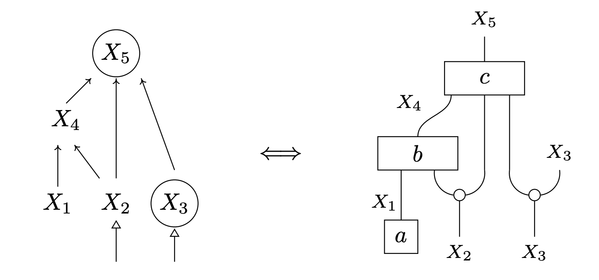

* Wires are **random variables**.
* Boxes are **conditional** probability distributions.
* Diagrams are **generative models**.

---

# Diagrams: generative models

```python
from discopy.markov import Ty, Box, Diagram

X1, X2, X3, X4, X5 = [Ty("X" + str(i)) for i in range(1, 6)]
a = Box("a", Ty(), X1)
b = Box("b", X1 @ X2, X4)
c = Box("c", X4 @ X2 @ X3, X5)

@Diagram.from_callable(X2 @ X3, X5 @ X3)
def model(x2, x3):
    x1 = a()
    x4 = b(x1, x2)
    x5 = c(x4, x2, x3)
    return (x5, x3)
```

---

# Categories: definition

A (strict monoidal) **category** $\mathbf{C}$ is a signature with three maps:

$$
\text{id} : \coprod_{x \in \mathbf{C}_0^\star} \mathbf{C}(x, x)
$$
$$
(\circ) : \prod_{x, y, z \in \mathbf{C}_0^\star} \mathbf{C}(x, y) \times \mathbf{C}(y, z) \to \mathbf{C}(x, z)
$$
$$
(\otimes) : \prod_{x, y, x', y' \in \mathbf{C}_0^\star} \mathbf{C}(x, y) \times \mathbf{C}(x', y') \to \mathbf{C}(xx', yy')
$$

such that associativity, unitality and naturality hold.

---

# Categories: examples

* $\mathbf{C}_\Sigma$: wires and diagrams.
* $\mathbf{Set}$: sets and functions (with cartesian product as tensor).
* $\mathbf{Rel}$: sets and relations (with cartesian product as tensor).
* $\mathbf{Vect}$: vector spaces and linear maps (with tensor product).
* $\mathbf{Stoch}$: measurable spaces and stochastic maps (with product).

---

# Categories: theorem

A (strict monoidal) **functor** $F : \mathbf{C} \to \mathbf{D}$ is a morphism of signatures that preserves identity, composition and tensor.

**Theorem** *(Joyal & Street, 1988)*: $\mathbf{C}_\Sigma$ is the free monoidal category.

$$
\mathbf{MonCat}(\mathbf{C}_\Sigma, \mathbf{D})
\simeq \mathbf{MonSig}(\Sigma, \mathbf{D})
$$

**Intuition:** The functors $F : \mathbf{C}_\Sigma \to \mathbf{D}$ are uniquely determined by their image on boxes, i.e. a morphism of signatures $F : \Sigma \to \mathbf{D}$.

---

# Example: Quantum NLP as a functor

```python
from discopy.pregroup import Ty, Word, Id, Cup
from discopy.circuit import Functor
from discopy.quantum import qubit, Ket, H, X, CX, sqrt

s, n = Ty('s'), Ty('n')
Alice, loves, Bob = Word('Alice', n), Word('loves', n.r @ s @ n.l), Word('Bob', n)

sentence = Alice @ loves @ Bob >> Cup(n, n.r) @ Id(s) @ Cup(n.l, n)

F = circuit.Functor(
    ob={s: Ty(), n: qubit},
    ar={Alice: Ket(0), loves: sqrt(2) @ Ket(0, 0) >> H @ X >> CX, Bob: Ket(1)})

assert F(sentence).eval()
```

---

# Categories: symmetric

A category is symmetric if it comes with **swaps**.

<style scoped> section img { display: block; float: left; }</style>


---

# Categories: compact

A symmetric category is compact if it comes with **cups and caps**:
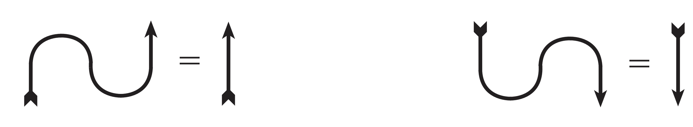

[Picturing Bayesian inference](https://arxiv.org/pdf/1102.2368), Coecke & Spekkens (2012)

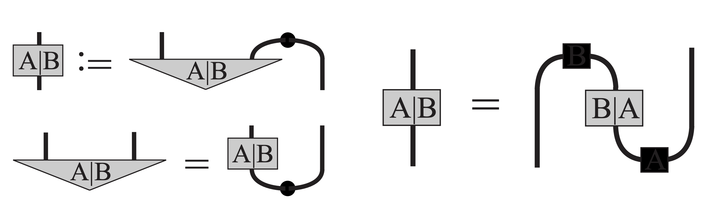

---

# Categories: cartesian

A symmetric category is cartesian if it has **copy and discard**.


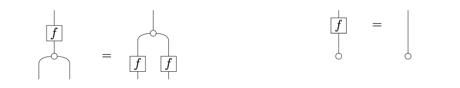

In physical terms, the last equation (again called **naturality**) is equivalent to **causality**: the future cannot influence the past.

---

# Categorical no-cloning

**Lemma:** Suppose a symmetric category has both cups and copy.


---

# Categorical no-cloning

**Theorem:** $\text{compact} \ + \ \text{copy} \implies \text{(almost) trivial}$


---

# Normalisation as a bubble

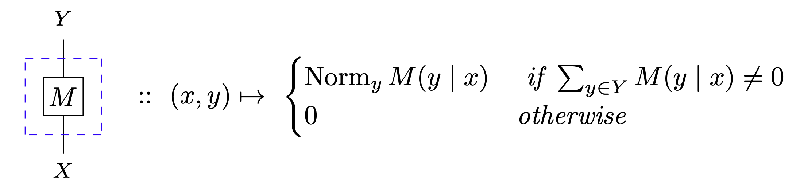

This gives an operation on diagrams which does not commute with sequential composition but satisfies the following properties:

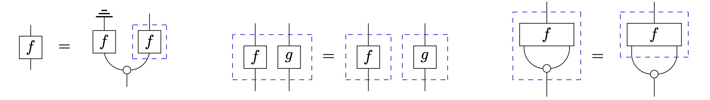


---

# Jeffrey vs Pearl update

<style scoped> img { display:block; float: left; }</style>


The difference between Jeffrey and Pearl updates amounts to a difference between

1. the normalisation of a composition
2. the composition of a normalisation.

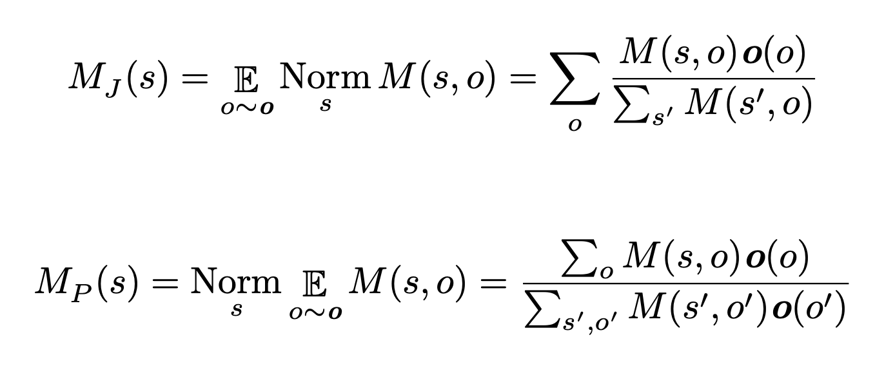

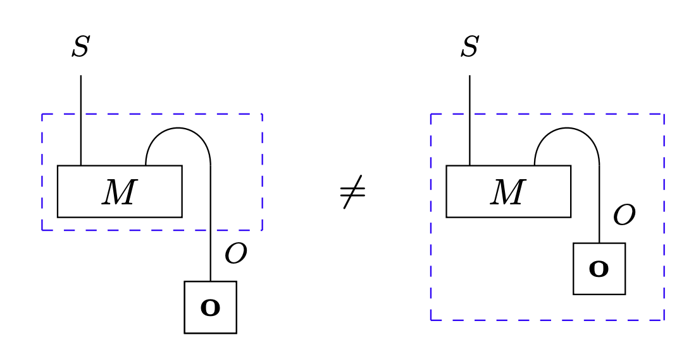

---

# Logarithm as a bubble


---

# Logarithm as a bubble

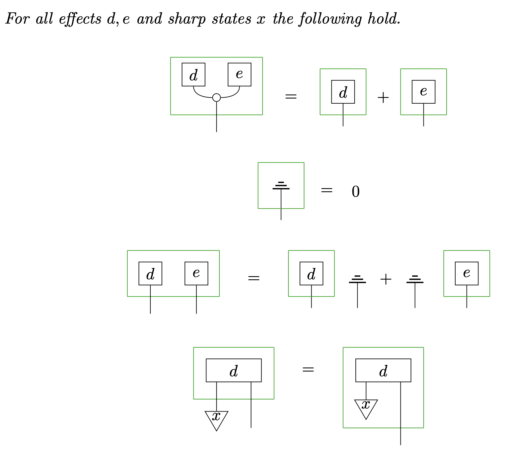

---

# Free energy with diagrams

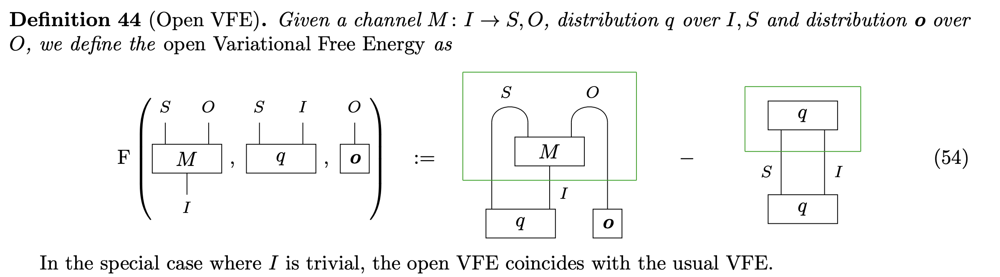

---

# Free energy is compositional

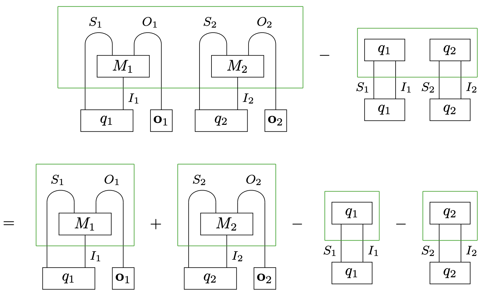

---

# DisCoPy for active inference

DisCoPy already has support for the following:

- finite-dimensional Bayesian inference via tensor networks
- automatic differentiation and JIT compilation via JAX
- bidirectional programming via the geometry of interaction (see Draithwaite et al. [compositional structure of Bayesian inference](https://arxiv.org/pdf/2305.06112))

---

# DisCoPy for active inference

What's missing for a more complete implementation:

- continuous probability via monads and Kleisli categories
- a geometry of delayed interaction for discrete time processes
- some active inference experimentalists ready to take on the challenge of compositionality!
